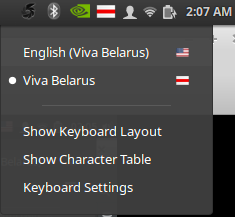

# 3rd level Linux XKB Belarusian keyboard layout 
------------------------------------------------

## Feature

* Add historical and national white-red-white Belarusian flag
* No longer need a Russian keyboard
* Enable Belarusian Latin as 3rd level of English keyboard

## Installation

Clone repository
```
git glone https://github.com/vtsykun/belarus-keyboard-layout.git
cd belarus-keyboard-layout
```

### Step1. Replace bssr flag

```
sudo cp images/by.png /usr/share/iso-flag-png/by.png
```

### Step2. Add custom 3rd level keyboard

Change `/usr/share/X11/xkb/symbols/by` to add a new layout. Add this lines to the end of the file.
[Example](xkb/by)

```
partial alphanumeric_keys
xkb_symbols "viva" {
	include "ru(winkeys)"
	name[Group1]= "Viva Belarus";

	key	<AD09> {	[	Byelorussian_shortu,	Byelorussian_SHORTU,	Cyrillic_shcha,	Cyrillic_SHCHA	]	};
	key	<AD12> {	[	apostrophe,	apostrophe, Cyrillic_hardsign,	Cyrillic_HARDSIGN		]	};
	key	<AB05> {	[	Ukrainian_i,	Ukrainian_I,	Cyrillic_i,		Cyrillic_I	]	};

	include "level3(ralt_switch)"
};

```

Change `/usr/share/X11/xkb/symbols/us` to enable Belarusian Latin. Add this lines to the end of the file.
[Example](xkb/us)

```
partial alphanumeric_keys
xkb_symbols "be-latin" {

    include "us"
    name[Group1]= "English (Viva Belarus)";

    key <AD02> {        [    w,    W,    scaron,    Scaron    ]       };
    key <AD07> {        [    u,    U,    ubreve,    Ubreve    ]       };
    key <AC02> {        [    s,    S,    sacute,    Sacute    ]       };
    key <AC09> {        [    l,    L,    lstroke,   Lstroke   ]       };
    key <AB01> {        [    z,    Z,    zacute,    Zacute    ]       };
    key <AB02> {        [    x,    X,    zcaron,    Zcaron    ]       };
    key <AB03> {        [    c,    C,    cacute,    Cacute    ]       };
    key <AB04> {        [    v,    V,    ccaron,    Ccaron    ]       };
    key <AB06> {        [    n,    N,    nacute,    Nacute    ]       };

    include "level3(ralt_switch)"
};

```

Add the new layout declaration to `/usr/share/X11/xkb/rules/evdev.xml` (copy & modify us layout section).
[Example](xkb/evdev.xml)

```

...
    <layout>
      <configItem>
        <name>by</name>

        <shortDescription>by</shortDescription>
        <description>Belarusian</description>
        <languageList>
          <iso639Id>bel</iso639Id>
        </languageList>
      </configItem>
      <variantList>
        <variant>
          <configItem>
            <name>legacy</name>
            <description>Belarusian (legacy)</description>
          </configItem>
        </variant>
  ....
 # -> new lines 
        <variant>
          <configItem>
            <name>viva</name>
            <description>Viva Belarus</description>
          </configItem>
        </variant>
 # ->  end new lines 
      </variantList>
    </layout>
...

...
        # The same for english keyboard
...

```

See patch, for details 

### Step3. Update xkb cache

Run command to update cache

```
sudo dpkg-reconfigure xkb-data
```

## Enjoy 




For russian layout
- `alt-і` for 'и'
- `alt-ў` for 'щ'
- `alt-'` for 'ъ'

For Belarusian Latin layout
- `alt-w` for 'š'
- `alt-u` for 'ŭ'
- `alt-s` for 'ś'
- `alt-l` for 'ł'
- `alt-z` for 'ź'
- `alt-x` for 'ž'
- `alt-c` for 'ć'
- `alt-v` for 'č'
- `alt-n` for 'ń'
